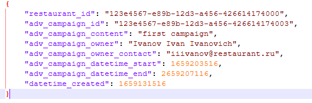
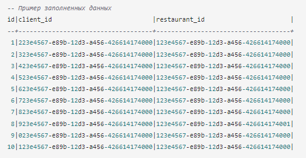

# Проектная работа по потоковой обработке данных

### Описание задачи
Агрегатор для доставки еды вводит новую опцию — подписку. Она открывает для пользователей ряд возможностей, одна из которых — добавлять рестораны в избранное. Только тогда пользователю будут поступать уведомления о специальных акциях с ограниченным сроком действия.  
Нужно создать Систему, которая поможет реализовать это обновление.

Система работает так:  
1. Ресторан отправляет через мобильное приложение акцию с ограниченным предложением. Например, такое: «Вот и новое блюдо — его нет в обычном меню. Дарим на него скидку 70% до 14:00! Нам важен каждый комментарий о новинке».  
2. Сервис проверяет, у кого из пользователей ресторан находится в избранном списке.  
3. Сервис формирует заготовки для push-уведомлений этим пользователям о временных акциях. Уведомления будут отправляться только пока действует акция. 

### Входные данные  
1. Данные из Kafka. Пример входного сообщения  
  
2. Список подписчиков из базы данных Postgres  
  

### Схема проекта  
  

### Используемые технологии
Spark Structured Streaming, Python, Kafka, PostgreSQL
